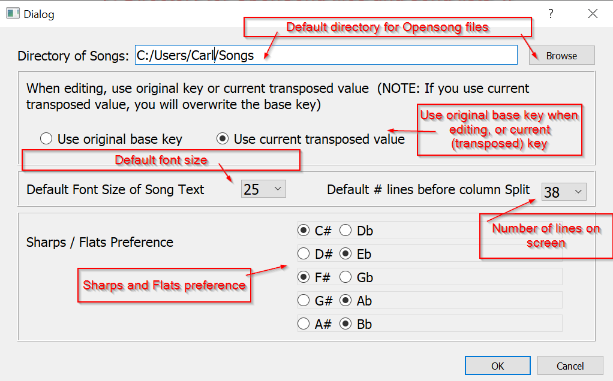

# OpenSongViewer
A windows and linux client for OpenSong written in Python3/Qt5 - for allows you to create/edit/view song files which contain lyrics and chords - use as an electronic songbook - for Windows clients.

# Features:

* Can open songs in the 'OpenSong' xml file format
* You can open a number of songs into a list, and jump between songs by clicking on the song name
* You can easily transpose the key of each individual song - this key-change is retained in the song list so you can return to it later.
* You can save the song list and load it back in at a later point in time - it'll retain any key-transpositions.
* You can edit any existing songs, or create new ones within the program itself.

# Binaries
Stand alone binary releases are in the 'Releases' area - go to https://github.com/carlbeech/OpenSongViewer/releases
(Under the release heading, click on 'Assets')

# HISTORY

### V0.1

- Initial release

### V0.2

- Added browse button to preferences dialog.
- Start of code cleanup
- Initial conversion to allow for linux filesystems.
- Internal update to switch to use 'dictionary' (key/value pairs) to hold preferences. (Auto updates V0.1 preferences)

# Description

I've been using OpenSong for a while now - the concept has been both simple, yet versitile enough to use on a daily basis when playing 'live' - I've especially liked the ability to transpose any song into any key I desire - its meant I've not had to carry around multiple copies of song sheets with me.

The normal way of working is to use the Windows main program to enter/edit songs, and have those songs saved to dropbox/google drive etc, which is then sync'd to my Android tablet. The Android tablet has an opensong viewer, and this is what is used on stage.

Recently, my Android tablet has shown signs of breaking down, however, I've got a Microsoft Surface - and while there's an OpenSong editor for Windows - I've not been able to get this to work as an 'on stage' viewer - i.e. able to create a list of songs, in particular keys, and use this as a music songbook (like the Android version) - so I decided to write one.

OpenSongViewer is written in Python3 and QT5 - and while you can run this from source code, I've also created stand-alone an executable version using PyInstaller (note it takes about 15 seconds to start up - please be patient.

## Notes

This is the first version of the program, and while I've successfully been using it, there's no-doubt there's bugs in the code! At this point its also very untidy.

# Documentation / User Guide

When you open the viewer, you should have a main screen split broadly into three main sections:

The Controls section has a number of controls:
* Add - bring up a file selection so you can choose an OpenSong song to add to the main song list.
* Del - remove _the currently selected song_ from the song list.
* Edit - edit _the currently selected song_ in the song list (brings up the edit dialog)

* < and > allow you to transpose the key of the currently selected song
* between < and > is shown the key for the currently selected song.

The Song Chords and Lyrics are shown in courier (non-proportional font) so that chords and words marry up - note that if the song is too long (currently 38 lines) the song is split into columns - use [ === ] to force a split when editing the song.

-> _if in doubt, ensure you click on a song in the Main Song List before doing anything_

Menu entries:
File:
* New - add a new song (brings up the edit dialog)
* Edit - edit the currently selected song
* Clear List - clear the main song list
* Preferences - bring up the preferences dialog.

Song List:
* Load song list - clears the current song list, and allows you to select a previously saved song list file.
* Save song list - saves the current song list
* Save song list as... - bring up a dialog to nominate a name and save the song list.

NOTE: every time you transpose or edit a song in the song list, the song list is saved - so if the program crashes, then you can re-load the song list immediately.

## The New / Edit screen
The editor window consists of three parts:
* The song (file) name - note this is the file name that is used
* The key - a pull down list so you can select the key of the song
* The editor text box

The editor window is a plain text box which is set to courier font - it is non-proportionally spaced so that you can set the positioning of chords e.g.

Lines beginning with '.' are chord lines - when you click on transpose keys, these are updated.
Ensure you put a space at the beginning of lines of lyrics - so that this marries up with the space taken up by the '.' in the chords lines.
Likes with [ and ] are verses and are highlighted when viewing the song.
Note: [===] means break column - i.e. shift to the next column.
 
Click OK to save the song (it saves to the file as well as the Main Song List).
 
## The Preferences screen
At this point, the preferences screen simply allows you to select the default location where song files are kept (unless told otherwise, the program will use the folder where the program is.

# Q & A

Q) Do I need to use the main OpenSong app (http://www.opensong.org/)?
A) Not necessarily - you're able to create songs within this program directly, however, you are able to open songs that have been created within OpenSong, and you should be able to open and use songs generated within this program within the main OpenSong app / Android app etc.

Q) OpenSong has a number of other facilities and data - will these be implemented?
A) In short, no - my intention is to create a simple viewer to effectively replace my (dying) android tablet's app - so I'm interested in what I'm able to use to facilitate playing the song - so I'm not necessarily concentrating on data items such as author etc.

Q) I don't like courier font - we don't you use Ariel etc?
A) Part of the simplicity of the OpenSong format is that you line up chords with the words by simply using spaces - if you use a proportional font such as Ariel, then the chords wouldn't match up with the words.

Q) The text is a bit small / large /doesn't fit my screen...
A) Being able to set the font size is something I'm thinking about... potentially on a song-by-song basis.
